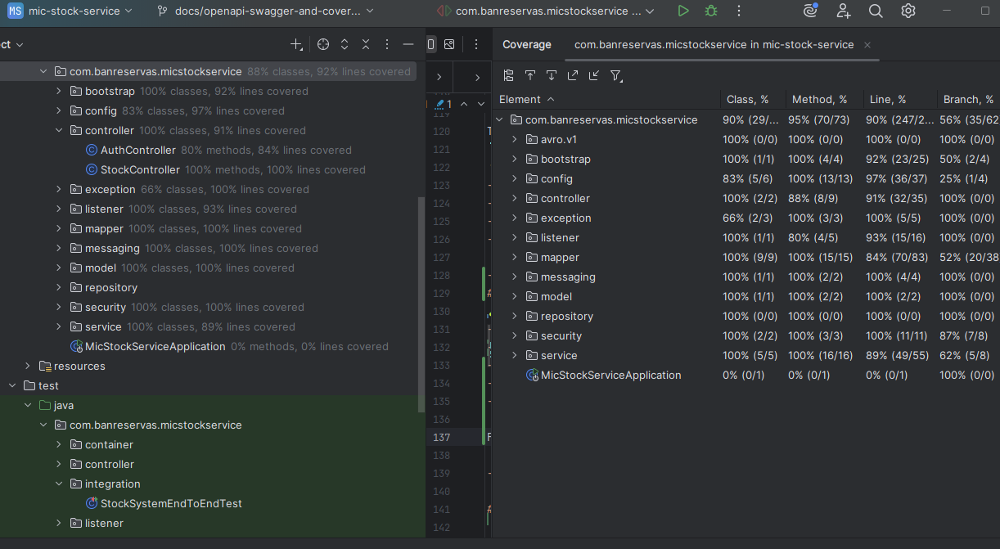

# 🧪 Testing Strategy

This project uses a comprehensive testing approach to ensure code quality, reliability, and security. The following types of tests and tools are applied:

## 1. Unit Testing

- **Framework:** JUnit 5
- **Mocking:** Mockito
- **Scope:** Tests individual components (services, utilities, mappers) in isolation.
- **Location:** `src/test/java`

## 2. Integration Testing

- **Framework:** JUnit 5
- **Testcontainers:** Used to spin up real Kafka and MongoDB instances in Docker containers for realistic integration tests.
- **Scope:** Verifies the interaction between components and external systems (Kafka, MongoDB).
- **Location:** `src/test/java`

## 3. WebFlux Testing

- **Framework:** Spring WebFlux Test
- **Tool:** WebTestClient
- **Scope:** Tests reactive REST endpoints, request/response validation, and error handling.

## 4. Security Testing

- **JWT Authentication:** Tests endpoints with and without valid JWT tokens.
- **Role-based Access:** Verifies access control for `ADMIN` and `USER` roles.

## 5. Test Execution

To run all tests, use:

```bash
mvn clean test
```

## 6. Best Practices

- Each test is independent and repeatable.
- Mocks are used for external dependencies in unit tests.
- Testcontainers ensure integration tests are environment-independent.
- Coverage includes positive and negative scenarios.

## 7. Coverage


- The project achieves **90% test coverage** across core business logic and REST endpoints.
- 
